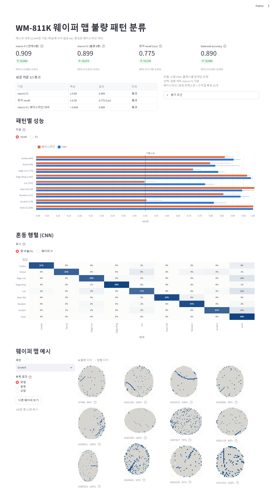

# WM-811K 웨이퍼 맵 결함 패턴 분류

공개 웨이퍼 맵 데이터셋 WM-811K(LSWMD)의 결함 패턴 9종(Center, Donut, Edge-Loc, Edge-Ring, Loc, Near-full, Random, Scratch, none)을 분류하는 파이프라인과 결과 대시보드. 24시간 개인 해커톤 연습 프로젝트다. 작업 과정은 [PLAN.md](PLAN.md), [LOG.md](LOG.md), [RESULT.md](RESULT.md), [GLOSSARY.md](GLOSSARY.md)에 기록한다.

**결과**: 학습에 쓰지 않은 lot의 웨이퍼 25,444장에서 소형 CNN이 macro-F1 0.909(95% CI 0.885–0.922)를 기록했다. 손으로 만든 특징 + 랜덤 포레스트 베이스라인(0.843)보다 0.066 높고, 가장 약하던 Loc recall은 0.497에서 0.775로, Scratch는 0.51에서 0.81로 올랐다. 자세한 수치, 버린 시도, 한계는 [RESULT.md](RESULT.md)에 있다.

> 진행 상황: 6단계(정리·재현 확인) 진행 중.

**한 줄로 전체 재실행** (데이터 받기부터 평가까지, 이 PC에서 약 4~5시간이며 대부분 CNN 학습 시간이다):

```powershell
.venv\Scripts\python scripts\run_all.py
```

## 1. 환경 구성 (Windows, Python 3.12)

```powershell
py -3.12 -m venv .venv
.venv\Scripts\python -m pip install -r requirements.txt
```

- `requirements.txt`는 버전을 고정했다. torch는 CUDA 11.8 빌드(`2.7.1+cu118`)라서 pip가 PyTorch index(`--extra-index-url`)에서 받는다. 파일 크기가 약 2.7 GB다.
- 개발 환경: Quadro P2000(Pascal, sm_61), NVIDIA 드라이버 472.84. 이 GPU를 지원하는 최신 torch(2.14+cu126)는 드라이버 560 이상이 필요해서 cu118 빌드를 골랐다.
- GPU 점검: `.venv\Scripts\python scripts\check_gpu.py`

## 2. 데이터 받기

```powershell
.venv\Scripts\python scripts\download_data.py
```

- 출처: Kaggle [`qingyi/wm811k-wafer-map`](https://www.kaggle.com/datasets/qingyi/wm811k-wafer-map). 공식 `kagglehub`로 로그인 없이 받는다(공개 데이터셋).
- 받은 zip(약 149 MiB)을 `data/raw/LSWMD.pkl`(2,095,505,977 B)로 푼다. 이어서 크기, SHA-256, DataFrame shape(811,457 × 6)를 검사하고, 이미 받은 파일이 있으면 다운로드를 건너뛴다.
- **데이터는 이 저장소에 포함하지 않는다.**

## 3. 데이터 탐색

```powershell
.venv\Scripts\python scripts\explore_data.py
```

- 클래스 분포, 맵 크기, lot 구조, 완전 중복·근사 중복(10픽셀 이내), 분할 방식별 누수율을 계산해 `outputs/eda/summary.json`에 저장하고 그림 5개를 만든다(이 PC에서 1분 39초).

## 4. 정제·분할·베이스라인

```powershell
.venv\Scripts\python scripts\make_splits.py
.venv\Scripts\python scripts\baseline.py
.venv\Scripts\python scripts\split_variance.py
```

- `make_splits.py`는 라벨 있는 웨이퍼만 남기고 라벨 충돌 쌍, 다이 100개 미만 맵, 완전 중복을 뺀다. 그다음 두 가지 분할을 만든다.
  - **주 분할**: lot과 "쌍둥이 맵"을 한 덩어리로 묶어 70/15/15로 나눈다. 쌍둥이 맵은 반전·회전 8가지 중 어느 것으로든 차이가 max(10, 불량 다이 수의 10 %) 이하인 맵이다.
  - **참고 분할**: 웨이퍼 단위 무작위 분할.
- 결과는 `data/processed/labeled_clean.pkl`(git 제외)과 `outputs/splits/split_summary.json`에 저장된다.
- `baseline.py`: 다수 클래스, 손으로 만든 특징 23개 + 로지스틱 회귀/랜덤포레스트, 셔플 라벨 대조군, 맵 크기만 쓰는 대조군을 돌린다. 신뢰구간은 연결 성분 단위 부트스트랩으로 구한다.
- `split_variance.py`: 분할 seed와 묶음 규칙을 바꿔 가며 베이스라인이 얼마나 흔들리는지 진단한다.

## 5. CNN 학습·평가

```powershell
.venv\Scripts\python scripts\train_cnn.py --split main --loss ce
.venv\Scripts\python scripts\train_cnn.py --split main --loss weighted
.venv\Scripts\python scripts\train_cnn.py --split random --loss ce
.venv\Scripts\python scripts\train_cnn.py --split main --loss ce --shuffle-labels --epochs 5
.venv\Scripts\python scripts\evaluate_cnn.py
```

- 맵을 64×64로 맞춰 소형 CNN(파라미터 58만 개)을 학습한다. 크기를 맞출 때 가로세로를 따로 조정하고, 줄일 때 불량 다이를 보존한다. 학습 중에는 반전·회전으로 증강하고, val macro-F1이 가장 좋은 epoch를 쓴다. GPU에서 실행 한 번에 약 35~40분 걸린다.
- `evaluate_cnn.py`는 두 가지로 평가한다: 원시 argmax, 그리고 val에서만 맞춘 클래스별 bias로 사후 보정한 결과. 최종 모델은 **val 성능만으로** 고르고, test는 선택에 쓰지 않는다.
- 결과는 `outputs/cnn/results.json`과 그림 3개(혼동 행렬, 클래스별 recall, 오분류 예시)다.

## 6. 대시보드

```powershell
.venv\Scripts\streamlit run scripts\dashboard.py
```

- 브라우저에서 http://localhost:8501 을 연다.
- 내용: 핵심 수치(베이스라인 대비), 클래스별 recall·F1 막대그래프, 혼동 행렬, 클래스별 맞힘·놓침·오탐 웨이퍼 맵 예시.
- 5단계까지의 산출물(`outputs/`, `data/processed/`)이 있어야 열린다.



## 7. 데이터 인용

WM-811K를 쓰려면 원 배포처(MIR Lab)의 조건에 따라 아래 두 가지를 인용한다.

- M.-J. Wu, J.-S. R. Jang, and J.-L. Chen, "Wafer Map Failure Pattern Recognition and Similarity Ranking for Large-Scale Data Sets," *IEEE Trans. Semiconductor Manufacturing*, vol. 28, no. 1, pp. 1–12, Feb. 2015, doi: 10.1109/TSM.2014.2364237.
- MIR Lab, WM-811K dataset, http://mirlab.org/dataSet/public/
